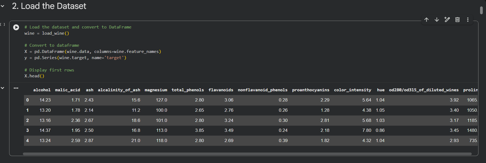
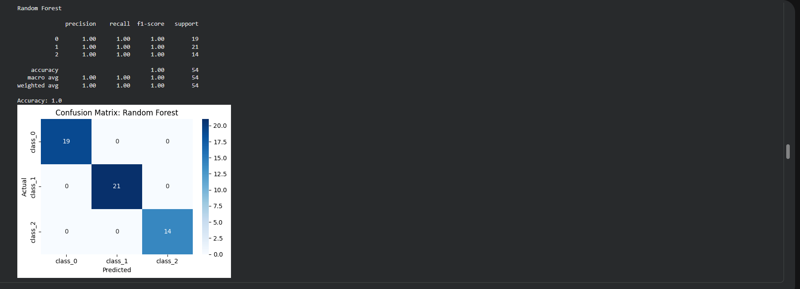
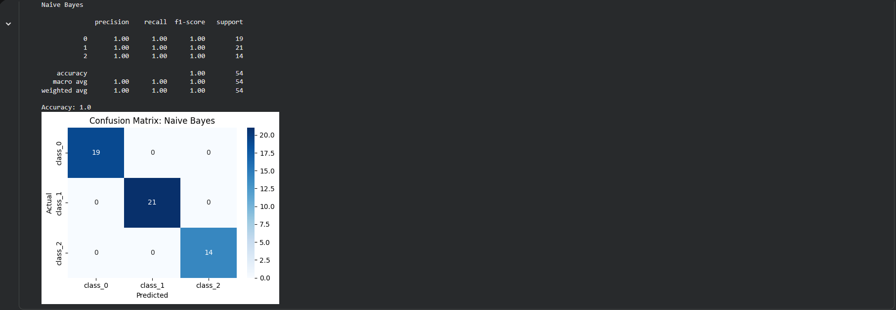
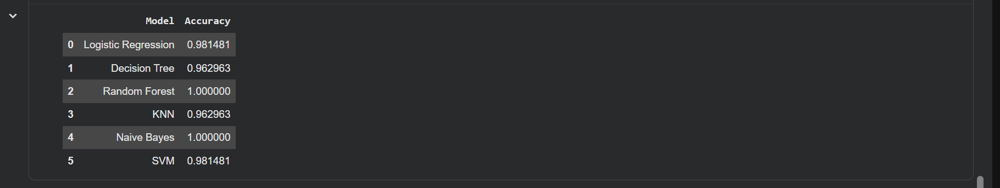
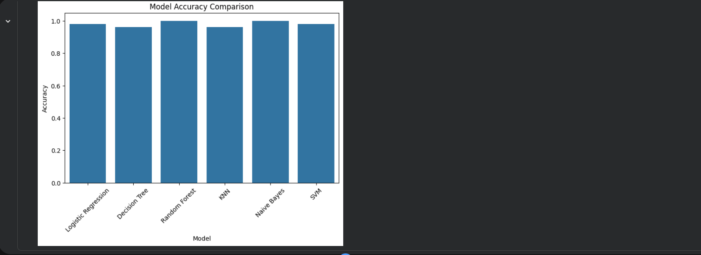

# Classification_models
# Wine Classification Models using Machine Learning
# Project Overview
This project demonstrates the implementation and evaluation of multiple supervised machine learning classification models using the Wine dataset from Scikit-learn.
The objective of the project is to train different classification algorithms and compare their performance using standard evaluation metrics such as accuracy, classification report, and confusion matrices.

#The models implemented include:
- Logistic Regression
- Decision Tree
- Random Forest
- k-Nearest Neighbors (KNN)
- Naive Bayes
- Support Vector Machine (SVM)

By comparing the models under the same dataset conditions, the project identifies which algorithm performs best for this classification task.

# Dataset
The project uses the Wine Dataset available in Scikit-learn.

# Dataset characteristics:
- 178 samples
- 13 numerical features
- 3 wine classes

# Technologies Used
Python, Google Colab, Pandas, NumPy, Matplotlib, Seaborn, Scikit-learn

# Project Workflow
The project follows a typical machine learning pipeline:

# 1. Data Loading
The Wine dataset is loaded from Scikit-learn and converted into a Pandas DataFrame for easier analysis.

# 2. Exploratory Data Analysis (EDA)
Initial exploration was performed to understand the dataset structure, feature relationships, and class distributions.

# 3. Data Preparation
The dataset was prepared by: Checking for missing values, scaling features using StandardScaler, splitting data into training and testing sets

# 4. Model Training
Six classification models were trained using the training dataset.

# 5. Model Evaluation
Each model was evaluated using: Accuracy Score, classification Report (Precision, Recall, F1-Score), confusion Matrix Visualization

# 6. Model Comparison
The models were compared to determine which algorithm performed best on the Wine dataset.

 # Model	Performance
Random Forest	High accuracy and stable predictions
Naive Bayes	Efficient and strong performance
Random Forest performed well due to its ensemble learning approach, while Naive Bayes achieved strong results despite its simplified probabilistic assumptions.

# Results and Visualizations
# 1. Dataset Preview
DataFrame preview of the Wine dataset.

# 2. Confusion Matrix – Random Forest
The confusion matrix below shows how accurately the Random Forest model classified each wine category.

# 3. Confusion Matrix – Naive Bayes
The confusion matrix below shows the prediction results of the Naive Bayes model.

# 4. Model Accuracy Comparison
A bar chart was created to compare model performance.

# Key Learning Outcomes
Through this project, I gained practical experience in:
- Supervised machine learning classification
- Data preprocessing and feature scaling
- Training multiple machine learning models
- Evaluating models using performance metrics
- Visualizing model results using confusion matrices
- Comparing algorithm performance
This project strengthened my understanding of how different classification algorithms behave when applied to the same dataset.

# How to Run the Project
This project was developed using Google Colab.
Step 1: Clone the repository
Step 2: Open the notebook in Google Colab
Step 3: Run the notebook cells sequentially to reproduce the results.
